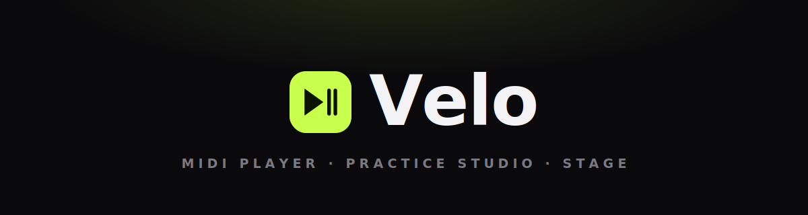
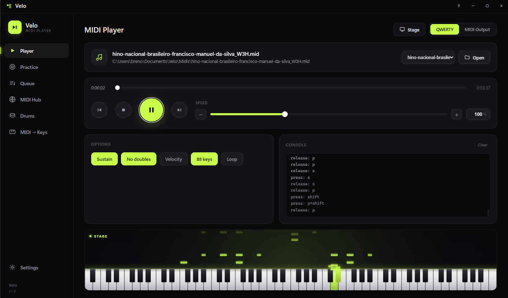
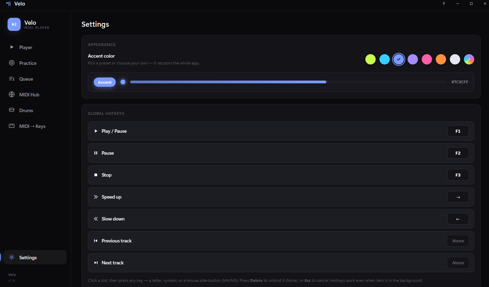
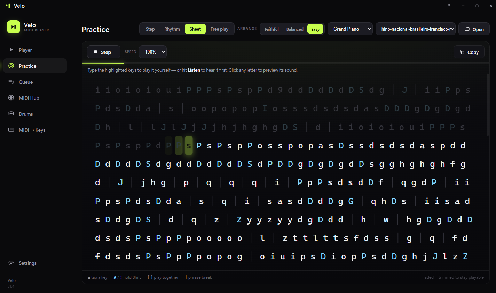
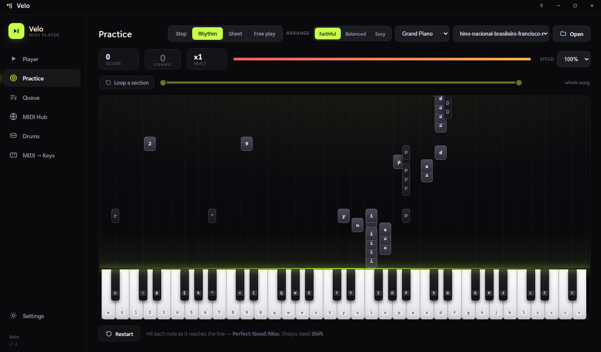
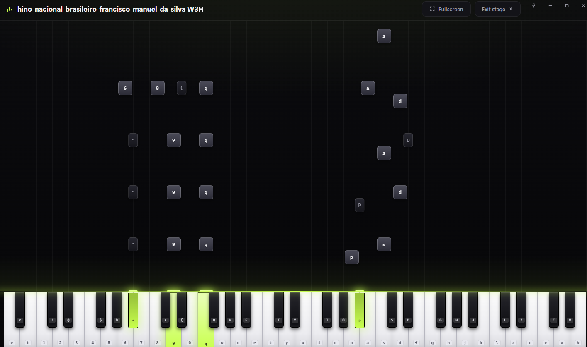

<p align="center">
  
</p>

<p align="center">
  <strong>A clean MIDI player — and now a full music studio.</strong><br/>
  Play MIDI as keystrokes (for virtual pianos in games) or MIDI output, practice it, and <strong>compose your own</strong>.
</p>

<p align="center">
  
  
  
  
</p>

<p align="center">
  <a href="https://github.com/brenucode/velo-midiplayer/releases/latest"></a>
</p>

---

**Velo** started from a simple itch: play MIDI in an interface that doesn't look like 2009 software. A clean player, a **built-in music editor**, an online song library, a practice mode that feels like a little game, and a stage mode to look good on stream. No bloat, no annoying install — open it and it works.

> ## ⚠️ "My antivirus says it's a virus / keylogger!" — It isn't. Please read this.
>
> Windows SmartScreen and some antivirus tools flag Velo — sometimes literally as a **"keylogger"** or "HackTool". **This is a false positive.** Here's the honest reason, so you can decide for yourself:
>
> - **Velo reads your keyboard on purpose — that's the whole feature.** It turns your typing into piano notes, and can "play" a song into on-screen game pianos (Roblox, Virtual Piano, etc.). To do that, it has to listen to the keyboard system-wide — which is *technically* the same low-level trick a real keylogger uses. Antivirus heuristics can't tell "makes music" apart from "steals passwords", so they raise the alarm. **Velo never records, stores, or sends your keystrokes anywhere.** You can verify that yourself: watch Velo's network activity — it only ever reaches out to **check for updates**, never to send your input.
> - **Velo is unsigned.** Removing the warning requires a **code-signing certificate (~US$300 per year)**. Velo is **free**, made in spare time — paying a yearly fee for a free app isn't worth it, so you get the scary "unknown publisher" warning instead of a signed, pre-trusted one.
>
> **What to do:**
> - **"Windows protected your PC"** → click **More info → Run anyway**.
> - **Antivirus deleted a file and Velo won't open?** → restore it from quarantine (commonly `Velo\_internal\pythonnet\runtime\Python.Runtime.dll`) and add the Velo folder as an exception.
> - **Still blocked?** → right-click the `.zip` → **Properties** → tick **Unblock** → extract again.

## Velo 2.1 — the Visualizer

🎆 **A fully customizable visualizer** — the falling-notes view is now a real, tunable light show. Ten **scene wallpapers** behind the notes, real **effects** (glow, particles, shockwaves, streaklets, chord-reactive bloom), a **rainbow** mode where notes cycle color forever (with an adjustable spin speed), your own **note & saber colors**, adjustable **darken / blur / vignette**, and a **auto-hiding gear** with one-click presets (Clean · Velo · Cinema · Overdrive · Light). It's measured to stay smooth (60fps), and it now drives **Practice → Free play and Rhythm** too — not just Stage. Recording a clip? Grab it with **OBS**.

## Velo 2.0 — Compose

🎹 **Compose** — make your own music, right inside Velo. A full **piano-roll editor**: **record** on your keyboard (with a 3·2·1 count-in), **paste** a Virtual-Piano sheet, **import** a MIDI, or **draw** notes with the mouse. A clean studio visualizer shows a real piano keyboard, glossy notes, a **ghost-note preview** of where each note will land, a pitch/position readout that follows your cursor, plus zoom-to-cursor and scrub-to-hear. **Save** it to your library, **export** a `.mid` or a sheet, or **Publish** it straight to the online library. It runs both here in the app **and** in your browser at **[velomidi.com/compose](https://velomidi.com/compose)**.

🎛️ **One keyboard, everywhere** — a unified MIDI-input layer means your MIDI keyboard now works the same in **Practice**, **MIDI → Keys** and **Compose**, on Windows and Linux.

↔️ **Expandable mini-player** — drag the pill's edge to widen it into a top bar so long song names fit.

🛡️ **Your library is safe when you update** — updating Velo no longer wipes your songs, backgrounds, compositions or settings. If you unzipped Velo *inside* your `Documents\Velo` folder, older versions could delete it during "Update and Restart" — **back it up once before updating to 2.0**, and from here on it's protected automatically.

<sub>Earlier: **v1.9** added **Velo Scan** (find the MIDIs already on your PC and import them — grouped by folder, no duplicates, undoable). **v1.8.2** added 9 keyboard-sound models, searchable dropdowns and a tabbed Settings redesign.</sub>


## 📸 Screenshots

<p align="center">
  <br/>
  <sub><b>Player</b> — now with the live mini-stage: watch the notes fall while a song plays.</sub>
</p>

<table>
  <tr>
    <td width="50%" valign="top"><br/><sub><b>Appearance</b> — recolor the whole app to any accent, and rebind hotkeys (incl. mouse M4/M5).</sub></td>
    <td width="50%" valign="top"><br/><sub><b>Practice (Sheet)</b> — any MIDI written out as Virtual-Piano letters you can play.</sub></td>
  </tr>
  <tr>
    <td width="50%" valign="top"><br/><sub><b>Practice (Rhythm)</b> — notes fall onto the keys; hit them in time.</sub></td>
    <td width="50%" valign="top"><br/><sub><b>Stage</b> — fullscreen visualizer, great for streaming.</sub></td>
  </tr>
</table>

## ✨ What it does

- 🎹 **Player** — plays MIDI via **keyboard (QWERTY)** or **MIDI output**. Song queue, speed control, previous/next, and **global hotkeys** that work even with the app in the background. A **floating mini-player** stays on top of your game, with a **Select Music** window to jump to any queued song (search, favorites, shuffle, loop).
- ✨ **Compose** — a built-in **piano-roll editor** to make your own music: record on your keyboard (3·2·1 count-in), paste a Virtual-Piano sheet, import a MIDI or draw notes, with a clean studio visualizer (ghost-note preview, live pitch/position readout, zoom-to-cursor, scrub-to-hear, loop shading). Save a `.mid`, export a sheet, or **publish to the library**. Also runs in the browser at **[velomidi.com/compose](https://velomidi.com/compose)**.
- 🎯 **Practice** — three modes on a 61-key piano that lights up which key to press:
  - **Step** — learn note by note, at your own pace. Miss it? It waits until you get it right.
  - **Rhythm** — turns into a rhythm game: notes fall in time, with **Perfect / Good / Miss**, combo, multiplier and a life bar.
  - **Free play** — a free piano (keyboard or mouse), with **rising trails** on every note and a **preview** that plays the song for you.
  - **Section trainer** — pick the hard part and drill it in **slow motion that speeds up** as you nail it.
- 🌐 **MIDI Hub** — search and download songs from three libraries without leaving Velo: the **nanoMIDI** library, **Online Sequencer**, and **BitMidi**. Pick the source from the dropdown; results show up in Velo's own UI.
- 🔎 **Velo Scan** — find the MIDI files already sitting on your computer and add them to your library. Tap the sonar, choose where to look, review the results grouped by folder, and import only what you want — no duplicates, and undoable.
- ▦ **Stage mode** — notes fall onto a **fullscreen** piano and the song **plays as they cross**, synced to what's playing, and they **follow your play style** (Faithful/Balanced/Easy). Perfect to leave on screen for Discord/streaming.
- 🎭 **Humanizer** — optional human feel: chord roll, timing/release wander, rubato and velocity variation, with profiles + sliders. Off by default (exact, mechanical original).
- 🥁 **Drums** and ⌨️ **MIDI → Keys** — turn a MIDI controller into a keyboard in real time.
- 🔊 **Real sound** — several **piano** models (Grand, Bright, Electric…) plus a **Cherry MX** mechanical-keyboard sound.
- 🏆 **Records** per song · 🖥️ **responsive** layout + **fullscreen (F11)**.

## 🎼 Companion app — VeloScribe

Got a song with no MIDI? **[VeloScribe](https://github.com/brenucode/veloscribe)** is Velo's companion tool: drop an audio file (or paste a link) and it transcribes it into a clean piano `.mid` — saved straight into Velo's queue. Same look, same family, made by the same person.

## ⬇️ Download (ready to use)

> No Python, nothing to install.

1. Go to **[Releases](../../releases)** and download `Velo-win.zip`.
2. Extract the folder anywhere.
3. Open **`Velo.exe`**.

Requires **Windows 10/11** with the **WebView2 Runtime** (already bundled in up-to-date Windows; if missing, Windows Update installs it, or grab it free from Microsoft).

<details>
<summary><b>It won't start? (rare)</b></summary>

Velo automatically removes the "downloaded from the internet" mark from its own files on first launch, so it should just work. If it still won't open:

- **Antivirus quarantined a file** — Velo is an unsigned app, so some antivirus tools remove a file by mistake. Check that `Velo\_internal\pythonnet\runtime\Python.Runtime.dll` still exists; if it's gone, restore it from quarantine and add the Velo folder as an exception.
- **Still blocked** — right-click `Velo-win.zip` → **Properties** → tick **Unblock** → **OK**, then extract again.
- **Missing .NET Framework** — on stripped Windows editions (N / LTSC), install the free **.NET Framework 4.8** from Microsoft.

</details>

## 🐧 Linux

Velo runs on Linux too — **Fedora, Ubuntu/Debian, Arch, openSUSE**. It uses your system's WebKit, so it's a quick one-time setup in a terminal:

```bash
git clone https://github.com/brenucode/velo-midiplayer.git
cd velo-midiplayer
./install-linux.sh
```

The installer pulls the libraries it needs, sets everything up, and adds **Velo** to your applications menu — then just search **"Velo"** and launch it like any app (or run `velo`). Full guide + troubleshooting: **[README-LINUX.md](README-LINUX.md)**.

> The "type the song into another app" feature (game pianos like Roblox / Virtual Piano) needs an **X11 / Xorg** session — Wayland blocks app-to-app typing. Everything else (player, sound, Practice, Stage) works on both.

## ⌨️ Global hotkeys

| Key  | Action |
|:----:|--------|
| `F1` | Play / Pause |
| `F2` | Pause |
| `F3` | Stop |
| `F4` | Speed up |
| `F5` | Slow down |
| `F6` | Previous track |
| `F7` | Next track |

You can remap any of them in **Settings**. They work even when Velo is minimized — handy for controlling it while you're in a game.

## 🧭 How to use

### 1. Play a song
1. **Player** tab → **Open** (or drag a `.mid` onto the window).
2. **Play** (or `F1`). Velo "types" the song into your virtual piano keys.
3. Want to play in a game (Roblox, etc.)? Keep the game focused and use the hotkeys — the keystrokes go to it.

> **QWERTY vs MIDI Output:** choose at the top of the Player. *QWERTY* simulates the keyboard (for in-game pianos). *MIDI Output* sends to an instrument/DAW via a MIDI port.

### 2. Download songs (MIDI Hub)
1. **MIDI Hub** tab → pick a source (**nanoMIDI**, **Online Sequencer** or **BitMidi**) and search by name.
2. Click the ↓ on a song — it downloads and drops straight into your queue.

> **Online Sequencer:** the first search opens a one-time check in a small window (it usually clears itself in a few seconds); after that, searching and downloading happen entirely inside Velo.

### 3. Practice
1. **Practice** tab → pick a mode (**Step / Rhythm / Free play**) and a song.
2. The on-screen keyboard lights up the right keys (sharps = **Shift**).
   - **Step:** press in sequence, no rush.
   - **Rhythm:** hit each note as it reaches the line.
   - **Free play:** play freely; pick a song and hit **Play (preview)** to watch it play itself.
3. **Section trainer:** toggle it on and drag the handles to drill just one part, slowly.

### 4. Stage mode (visualizer)
On the **Player**, click **Stage** (or `F11` for fullscreen). Hit play on a song and the notes fall onto the piano and play as they cross, in sync — great for streaming.

> Tip: turn on **Humanize** (Settings) for a less robotic, more played feel.

### 5. 🎙️ Sound like you're playing live (Discord / stream)
The idea: route Velo's piano sound into your virtual "microphone".

1. Install **[VB-CABLE](https://vb-audio.com/Cable/)** (a free virtual audio cable).
2. In Windows, under **Settings → System → Sound → Volume mixer**, send **Velo**'s output to **`CABLE Input`**.
3. In **Discord / OBS**, pick the microphone **`CABLE Output`**.
4. In Velo, under **Settings → Sound**, turn the sound on (piano or keyboard) and hit play.
5. Done — whoever's listening hears the piano as if it were you playing.

> Want to **talk and play at the same time**? Use **VoiceMeeter** to mix your real mic + Velo's audio into one channel.

### 6. Drums and MIDI → Keys
- **Drums:** same idea as the Player, with a drum map.
- **MIDI → Keys:** plug in a MIDI controller and play — Velo converts it to keystrokes in real time.

### 7. Compose (make your own music)
1. **Compose** tab → start from a blank roll, or bring notes in: **Record** (play your keyboard after the 3·2·1 count-in), **Paste a sheet**, **Import MIDI**, or **draw** with the mouse (a ghost note shows exactly where it'll land).
2. Shape it: drag to move/resize, edit velocity in the bottom lane, snap to the grid, and set a key so you stay in tune. Zoom with `Ctrl`+scroll (toward the cursor), scrub the timeline to hear it.
3. **Save** to your library, **Copy sheet** / **export a `.mid`**, or **Publish** it to [velomidi.com](https://velomidi.com) — link your account once and it goes through the same library as the site.

> Prefer the browser? The exact same editor lives at **[velomidi.com/compose](https://velomidi.com/compose)**.

## 🛠️ Run from source

Requirements: **Python 3.12** (Windows) and the **WebView2 Runtime**.

```bash
python -m venv venv-win
venv-win\Scripts\activate
pip install -r requirements.txt
python velo_app.py
```

To build the `.exe` (PyInstaller, anti-false-positive setup):

```bash
scripts\build-velo-win.bat
```

The app lands in `dist\Velo\Velo.exe`.

**On Linux**, just run `./run-linux.sh` (or `./install-linux.sh` to also add it to your apps menu) — see [README-LINUX.md](README-LINUX.md) for the system packages it needs.

## 📄 License & why Velo is no longer open-source

Velo **used to be open-source (GPL v3)**. It isn't anymore — from **v2.1** on, Velo is **closed-source**, and this repository no longer publishes the app's code.

**Why the change?** Velo grew from a small MIDI player into something much bigger — a full **Compose** studio, a custom visualizer, an online library and website, and a lot of original work poured in over many months. Keeping all of that open meant anyone could take the whole thing and ship their own copy of it. To keep building Velo sustainably and protect that work, newer versions are now closed-source.

**What this means for you, the user: nothing changes.** Velo is still **free**, still just download-and-run. You simply can't read or fork the source of the new versions anymore.

Older versions that were released under **GPL v3 stay under GPL v3** for the copies already out there — that can't be (and isn't being) undone.

**Velo** — created by **brenu** · [github.com/brenucode](https://github.com/brenucode)
Copyright © 2026 brenu. **All rights reserved.** See [LICENSE](LICENSE).

Velo is built on the playback engine of **[nanoMIDIPlayer](https://github.com/NotHammer043/nanoMIDIPlayer)** (NotHammer043), used **with the author's permission** — thanks for the base.

Sounds: **MusyngKite** pianos ([midi-js-soundfonts](https://github.com/gleitz/midi-js-soundfonts)) and the **Cherry MX** keyboard ([Mechvibes](https://github.com/hainguyents13/mechvibes)).

Song libraries in the MIDI Hub belong to their respective services — **nanoMIDI** ([nanomidi.net](https://nanomidi.net)), **[Online Sequencer](https://onlinesequencer.net)** and **[BitMidi](https://bitmidi.com)**. Velo just gives you a tidy way to search them; all rights stay with them and their uploaders.

<p align="center"><sub>built in my spare time — because not every project needs a reason.</sub></p>
